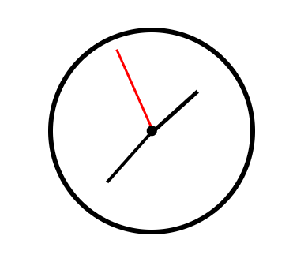

    analog-saat
    ├── 📄 index.html
    ├── 📂 assets
    │   ├── 📂 css
    │   │    └── 📄 style.css
    │   └── 📂 js
    │        └──  📄 script.js

```html
<!DOCTYPE html>
<html lang="en">
<head>
    <meta charset="UTF-8">
    <meta name="viewport" content="width=device-width, initial-scale=1.0">
    <title>Analog Saat</title>
    <link rel="stylesheet" href="assets/css/style.css">
</head>
<body>
    <div class="clock">
        <div class="hand hour" id="hour"></div>
        <div class="hand minute" id="minute"></div>
        <div class="hand second" id="second"></div>
        <div class="center-point"></div>
    </div>

    <script src="assets/js/script.js"></script>
</body>
</html>
```
<div style="display:flex; justify-content: center;">
    
<div>